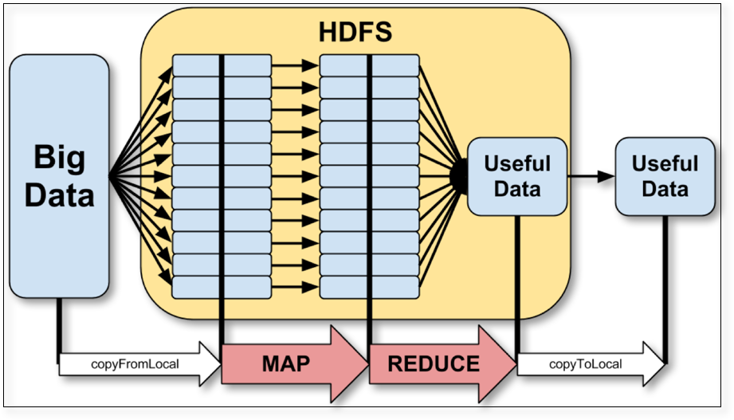
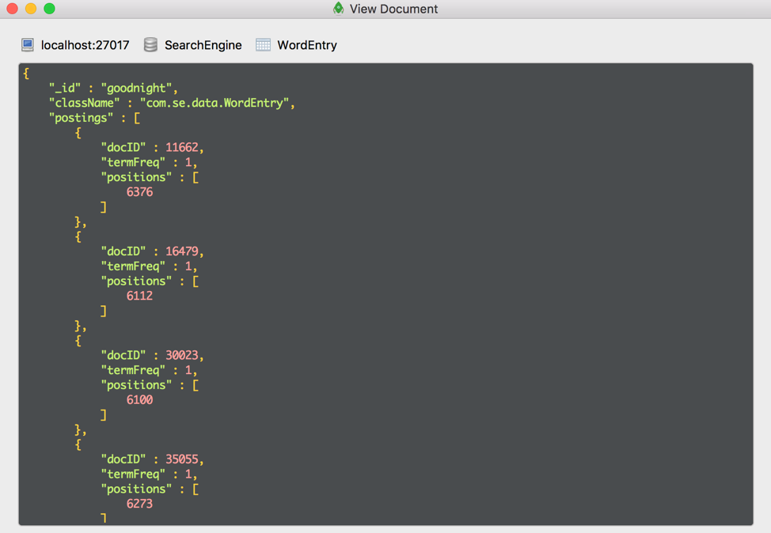
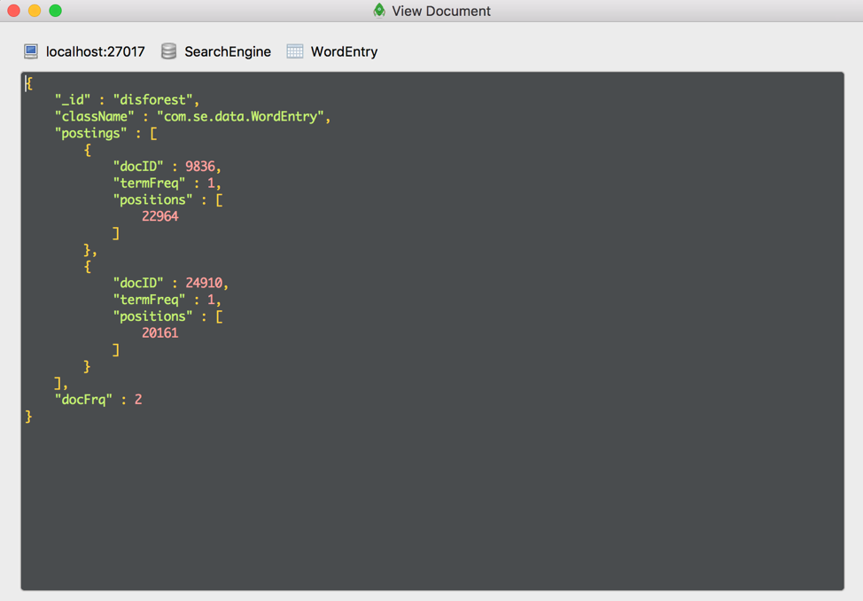

***Algorithm***

***EXPLANATION***

-   The list of HTML files present in the directory and the
    sub-directories has been extracted. BookKeeping file is given as
    input to the map reduce job

-   Hadoop map-reduce has been used for creating the inverted index and
    posting list for each term.

-   In the mappers section, a unique ID is generated for each file. The
    document is parsed and tokenized using Jsoup. Stop words has been
    removed and the tokens are stemmed.

-   Each HTML page has been parsed using Jsoup which is a Java HTML
    parser library.

-   Jsoup can extract the content present in each section such as head,
    title, body.

-   Information present in the body section has been extracted by using
    doc.body().text(), where doc contains the information of whole HTML
    document.

-   Information of the body section is tokenized and the posting list is
    created for each term.

-   The posting list includes Term, Term Frequency, path and Position of
    each term in the document.

-   Each term and the posting list pair is sent to the reducer section.

-   The reducer section collects the information of all the mappers and
    saves the data in the MongoDB.

***Hadoop Map-Reduce***

-   MapReduce is a processing technique where data can be processed on
    large clusters in parallel.

-   Distributed Computing can be achieved using Map-Reduce.

-   There are mainly two tasks involved namely Map and Reduce.

-   Large sets of data are taken by the Map job line by line and
    converted into key-value pairs.

-   The processes information is sent to the mapper.

-   Reduce job processes the data given by the map task. Several tasks
    of the mapper are combined by the reducer and the data is processed
    to produce the new output.

{width="5.994711286089239in"
height="3.367843394575678in"}

**Fig. 1 Map-Reduce example** (Source -
http://www.glennklockwood.com/data-intensive/hadoop/mapreduce-workflow.png)

***MongoDB***

-   MongoDB is a document oriented database which provides easy
    scalability and high performance.

-   It works on the principle of document and collection.

-   It can be used in high-end applications such as Big Data, Mobile
    Applications, Networks, Data Management and many more.

-   There is no concept of relationship as in any relational database.

-   In MongoDB, each collection has different set of documents.

-   Dynamic queries are supported by MongoDB.

-   Data is stored in JSON file format.

***Statistics***

  **PARAMETER**                 **COUNT**
  ----------------------------- -----------------
  No of parsed Documents        37500
  No of Unique Words            ***534494***
  Total size of Index on Disk   ***179.90 MB***
  No of Invalid Files           150

***Statistics of Collection in MongoDB***

(media/image2.png){width="7.112018810148731in"
height="4.257094269466316in"}

***Total size of the collection***

&gt; use Search Engine switched to db SearchEngine\
&gt; db.WordEntry.totalSize()\
2017-03-03T22:58:14.559-0800 I NETWORK \[thread1\]

trying reconnect to 127.0.0.1:27017 (127.0.0.1)

failed\
2017-03-03T22:58:14.567-0800 I NETWORK \[thread1\]

reconnect 127.0.0.1:27017 (127.0.0.1) ok\
188645376\
&gt; db.WordEntry.totalSize()\
188645376

***Examples of Postings***

{width="6.492361111111111in"
height="4.522916666666666in"}

{width="6.492361111111111in"
height="4.492361111111111in"}
