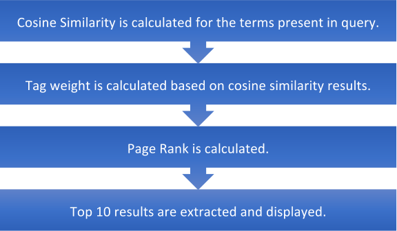

ICS Search Engine
---------------

<table>
  <tr>
    <td>Project Members</td>
  </tr>
  <tr>
    <td>Vivek Narayanamurthy</td>
  </tr>
  <tr>
    <td>Yathish Sudhakara Gangolli</td>
  </tr>
  <tr>
    <td>Snehal Gandham</td>
  </tr>
</table>

**Algorithm**

**EXPLANATION**

* The list of HTML files present in the directory and the sub-directories has been extracted. BookKeeping file is given as input to the map reduce job

* Hadoop map-reduce has been used for creating the inverted index and posting list for each term.

* In the mappers section, a unique ID is generated for each file. The document is parsed and tokenized using Jsoup. Stop words has been removed and the tokens are stemmed.

* Each HTML page has been parsed using Jsoup which is a Java HTML parser library.

* Jsoup can extract the content present in each section such as head, title, body.

* Information present in the body section has been extracted by using doc.body().text(), where doc contains the information of whole HTML document.

* Information of the body section is tokenized and the posting list is created for each term.

* The posting list includes Term, Term Frequency, path and Position of each term in the document.

* Each term and the posting list pair is sent to the reducer section.

* The reducer section collects the information of all the mappers and saves the data in the MongoDB. 

* TF-IDF per document per query is calculated.

* The stemmed tokens are searched in the inverted index table.

* For terms in the query, TF-IDF is calculated.

* The cosine similarity is calculated for all the terms present in the query. 

* Tag weights are calculated based on cosine similarity results.

* Page Ranks is calculated for all the terms.

* The top 10 results are extracted and displayed in the UI.

**Hadoop MapReduce**

* MapReduce is a processing technique where data can be processed on large clusters in parallel.

* Distributed Computing can be achieved using Map-Reduce.

* There are mainly two tasks involved namely Map and Reduce.

* Large sets of data are taken by the Map job line by line and converted into key-value pairs. 

* The processes information is sent to the mapper.

* Reduce job processes the data given by the map task. Several tasks of the mapper are combined by the reducer and the data is processed to produce the new output.

**Fig. 1 Map-Reduce example** (Source - http://www.glennklockwood.com/data-intensive/hadoop/mapreduce-workflow.png)

**MongoDB**

* MongoDB is a document oriented database which provides easy scalability and high performance.

* It works on the principle of document and collection.

* It can be used in high-end applications such as Big Data, Mobile Applications, Networks, Data Management and many more.

* There is no concept of relationship as in any relational database.

* In MongoDB, each collection has different set of documents.

* Dynamic queries are supported by MongoDB.

* Data is stored in JSON file format.

The following parameters are considered as weighing factors for the retrieval of results:

1. **TF-IDF:**

* TF-IDF stands for term frequency-inverse document frequency.

* If a term appears more number of times in a document, TF-IDF increases. Conversely, it decreases with the increase in the corpus.

* Term frequency (tf) is the number of times the term appears in the document.

* Inverted document frequency (idf) is the number of documents which contains a term.

* TF-IDF is the product of term frequency and inverted document frequency.

    * TF-IDF(score)=log(1+tf)*log(N/df) 

where tf= term frequency and 

 df = document frequency

2. **Cosine Similarity**

* It shows how the two documents are similar to each other.

    * Cosine Similarity = (A*B)/(|A|*|B|)

where, A is the tf-idf weight of the term in the query 

   B is the tf-idf weight of the term in the document.

3. **Page Rank**

* The number of quality links pointing to a page is determined to determine the importance of the link. 

    * Page Rank = *PR(A) = (1-d) + d ∑ (PR(Ti)/C(Ti))*

where, A is the page

	         d is the damping factor

	         T1 to Tn are the pages that link to A

	          PR(Ti) is the page rank of Ti

	          C(Ti)  is the number of outgoing links from Ti 

4. **Tag Weight**

* Weights have been assigned to the tags for the calculation of score. 

**NDCG Output**

NDCG has been improved by the following ways:

* Initially, score was summation of weighted cosine similarity and weighted TF-IDF also weighted score of the title tags were considered.

* First, only the title tags were considered. Later, all the tags such as h1, h2, h3 and b were also considered for scoring to improve NDCG.

* Later to improve NDCG, weighted PageRank and weighted anchor text was considered. This made a significant impact on the scoring and NDCG values improved by a good margin.

* Query:	mondego

NDCG:	[1.0, 0.9, 0.7186363722895477, 0.6196759928464199, 0.5690530481519784, 0.530150635327948, 0.5087987850294434, 0.49031924173526126, 0.4820347515221612, 0.4743862266508797]

After improvement

NDCG:	[1.0, 0.9, 0.7186363722895477, 0.6196759928464199, 0.5690530481519784, 0.530150635327948, 0.5087987850294434, 0.49031924173526126, 0.4820347515221612, 0.4743862266508797]

	

* Query:	machine learning

NDCG:	[0.0, 0.0, 0.0, 0.0, 0.0, 0.0, 0.0, 0.0, 0.0, 0.0]

After improvement

NDCG:	[0.8, 0.4, 0.31939394323979897, 0.27541155237618664, 0.25291246584532373, 0.23562250459019912, 0.2261327933464193, 0.21791966299344945, 0.2987182415072816, 0.30984559478351315]

* Query:	software engineering

NDCG:	[0.0, 0.0, 0.0, 0.0, 0.0, 0.0, 0.0, 0.0, 0.0, 0.0]

After improvement

NDCG:	[0.8, 0.4, 0.3697727287149246, 0.3877057761880933, 0.3560330822443896, 0.33169344292699493, 0.31833446857814457, 0.39757243814012383, 0.475335582735043, 0.4995276844019553]

* Query:	security

NDCG:	[0.0, 0.0, 0.050378785475125615, 0.043441335717860005, 0.03989249993773494, 0.03716531218924599, 0.03566847689512042, 0.034372999817708035, 0.033792229665639544, 0.03325604278650368]

After improvement

NDCG:	[0.0, 0.1, 0.07984848580994974, 0.20655866428213998, 0.1896843493839928, 0.17671687844264936, 0.18973712656751643, 0.18284588478769329, 0.1797564997216119, 0.17690427370563752]

* Query:	student affairs

NDCG:	[0.0, 0.0, 0.0, 0.0, 0.0, 0.0, 0.0798428837207439, 0.07790269703355178, 0.07790269703355178, 0.07790269703355178]

After improvement

NDCG:	[0.0, 0.25, 0.3297209129983399, 0.3301965323026638, 0.3069867634512092, 0.28875525026438387, 0.2810702329741794, 0.27424021007458305, 0.27424021007458305, 0.27424021007458305]

* Query:	graduate courses

NDCG:	[0.0, 0.0, 0.0, 0.0, 0.0, 0.0, 0.0, 0.0, 0.0, 0.0]

After improvement

NDCG:	[0.0, 0.0, 0.0, 0.0, 0.0, 0.0, 0.0, 0.0, 0.08448057416409886, 0.08314010696625919]

* Query: Crista Lopes

NDCG:	[0.0, 0.0, 0.050378785475125615, 0.043441335717860005, 0.03989249993773494, 0.03716531218924599, 0.03566847689512042, 0.034372999817708035, 0.033792229665639544, 0.03325604278650368]

After improvement

NDCG:	[1.0, 0.5, 0.3992424290497487, 0.4819702166583266, 0.44259681522931654, 0.4123393830328485, 0.3957323883562338, 0.38135941023853653, 0.3749159178505698, 0.36896706517290645]

* Query:	REST

NDCG:	[0.0, 0.5, 0.4043349044019921, 0.35109927064069857, 0.3615656177163081, 0.3400927429474089, 0.3842700036514319, 0.37493222036219837, 0.46692199713786153, 0.46692199713786153]

After improvement

NDCG:	[1.0, 0.5, 0.4043349044019921, 0.35109927064069857, 0.3615656177163081, 0.3400927429474089, 0.3310414145042692, 0.3715972045528758, 0.463586981328539, 0.463586981328539]

* Query:	computer games

NDCG:	[0.0, 0.0, 0.20151514190050246, 0.17376534287144002, 0.15956999975093977, 0.14866124875698397, 0.14267390758048168, 0.13749199927083214, 0.13516891866255817, 0.2123599954525518]

After improvement

NDCG:	[0.0, 0.0, 0.25189392737562805, 0.21720667858929998, 0.1994624996886747, 0.27697778829458214, 0.2658224903894528, 0.2561678324691613, 0.25183959135528783, 0.2478436110406492]

* Query:	information retrieval

NDCG:	[0.0, 0.2222222222222222, 0.18360770158412443, 0.16816912804522902, 0.1622920069247805]

After improvement

NDCG:	[0.0, 0.0, 0.0, 0.21021141005653626, 0.20286500865597562]

	

